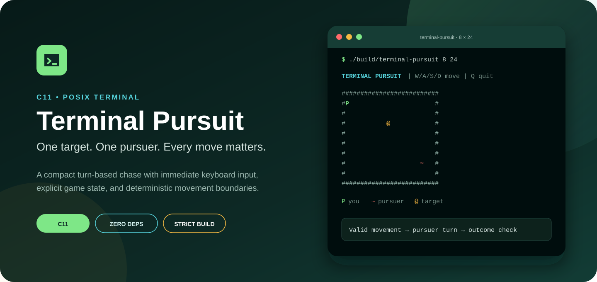
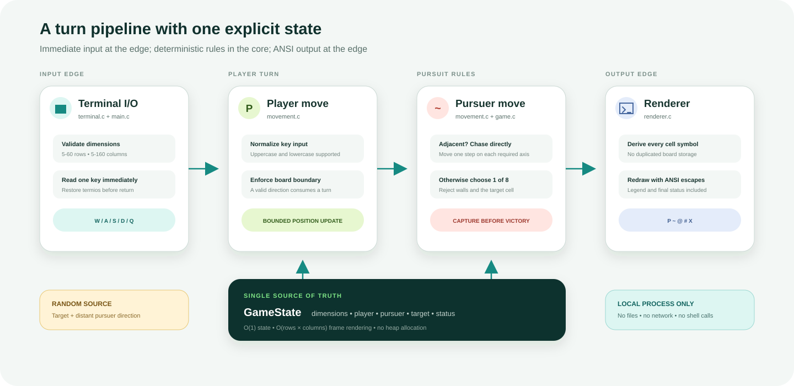

  

  
  
  
  
  

  <strong>One target. One pursuer. Every move matters.</strong> 
  A compact terminal chase that keeps input, game rules, state, and rendering
  deliberately separate.

---

## Why Terminal Pursuit

Terminal Pursuit explores how much structure a small C program can carry without
becoming overengineered. The player crosses a configurable grid to reach a
target while a pursuer reacts after every valid directional command.

The project is intentionally focused: no framework, no external library, no
saved state, and no network access. Its value is in a clear turn pipeline,
strict boundaries, and predictable low-level behavior.

### Game rules

- <strong>P</strong> starts in the upper-left playable cell.
- <strong>~</strong> starts in the opposite corner.
- <strong>@</strong> is placed randomly away from both actors.
- A W, A, S, or D command consumes one turn—even against a wall.
- An adjacent pursuer moves directly toward the player.
- A distant pursuer selects one of eight neighboring directions.
- The pursuer cannot enter the target cell.
- Capture is resolved before victory when both could occur on the same turn.

## Run it

### Prerequisites

- A C11 compiler such as Clang or GCC
- POSIX <code>termios</code> support
- <code>make</code>

Linux and macOS are verified in CI.

### Build

~~~bash
git clone https://github.com/Himath2002/terminal-pursuit-c.git
cd terminal-pursuit-c
make
~~~

The executable is generated at <code>build/terminal-pursuit</code>.

### Play

~~~bash
./build/terminal-pursuit 12 28
~~~

The two arguments define the playable area; the renderer adds a one-cell
boundary around it.

| Argument | Accepted range | Meaning |
| --- | ---: | --- |
| <code>rows</code> | 5-60 | Playable rows |
| <code>columns</code> | 5-160 | Playable columns |

Use <code>--help</code> to print the same contract from the executable.

### Controls

| Key | Action |
| --- | --- |
| W | Move up |
| A | Move left |
| S | Move down |
| D | Move right |
| Q | End the session cleanly |

Uppercase and lowercase input are accepted. Terminal settings are restored
after every key read, including blocked moves and normal exit.

## Architecture

  

The core does not store a two-dimensional character array. Instead,
<code>GameState</code> holds dimensions, three positions, and the current
status. The renderer derives each visible cell from that state, eliminating a
second representation that could drift out of sync.

~~~text
terminal_read_key
        │
        ▼
movement_apply_player_input
        │ accepted direction
        ▼
movement_advance_pursuer
        │
        ▼
game_update_status
        │
        ▼
renderer_draw
~~~

### Module responsibilities

| Module | Responsibility |
| --- | --- |
| <code>main.c</code> | CLI validation, target placement, and loop orchestration |
| <code>game.c</code> | State initialization, bounds, target validity, and outcomes |
| <code>movement.c</code> | Player commands and pursuer movement policy |
| <code>terminal.c</code> | Immediate single-byte input with terminal restoration |
| <code>renderer.c</code> | ANSI redraw, board symbols, legend, and final message |
| <code>random_source.c</code> | Inclusive, rejection-sampled random integers |

## Design decisions

| Concern | Decision |
| --- | --- |
| State ownership | One explicit <code>GameState</code> value |
| Memory | Constant-size state; no heap allocation |
| Rendering | O(rows × columns) derived frame |
| Movement | O(1) player and pursuer updates |
| Input | POSIX immediate mode, restored before each return |
| Randomness | Time-seeded standard C source with modulo-bias rejection |
| Portability | C11 plus the POSIX terminal boundary only |
| Safety | Strict dimension limits and full numeric parsing via <code>strtol</code> |

## Verification

Reproduce the complete local quality gate:

~~~bash
make clean all check
~~~

The build enables:

~~~text
-std=c11 -Wall -Wextra -Wpedantic -Werror
~~~

Focused checks cover initialization, playable boundaries, wall turns,
adjacent diagonal pursuit, target-cell protection, and victory resolution.
CI runs the same build and checks on both Ubuntu and macOS, while Dependabot
reviews GitHub Actions versions monthly.

## Project structure

~~~text
terminal-pursuit-c/
├── .github/workflows/ci.yml
├── docs/
│   ├── architecture.svg
│   └── hero.svg
├── include/terminal_pursuit/
│   ├── game.h
│   ├── movement.h
│   ├── random_source.h
│   ├── renderer.h
│   └── terminal.h
├── src/
│   ├── game.c
│   ├── main.c
│   ├── movement.c
│   ├── random_source.c
│   ├── renderer.c
│   └── terminal.c
├── tests/test_game.c
├── Makefile
└── README.md
~~~

## Scope

Terminal Pursuit is designed for ANSI-compatible POSIX terminals. Windows
Console support, replay files, configurable AI policies, scoring, and
multiplayer are outside this focused release.

The program does not read or write files, open sockets, execute shell commands,
or retain user data.

## Provenance

This release preserves the original game concept while replacing earlier
utility snippets with repository-owned implementations. See
[ACKNOWLEDGEMENTS.md](ACKNOWLEDGEMENTS.md) for the concise provenance note.

Release history is recorded in [CHANGELOG.md](CHANGELOG.md).

## License

Released under the [MIT License](LICENSE).

---

  Designed and engineered by <a href="https://github.com/Himath2002">Himath Ahangama</a>.

